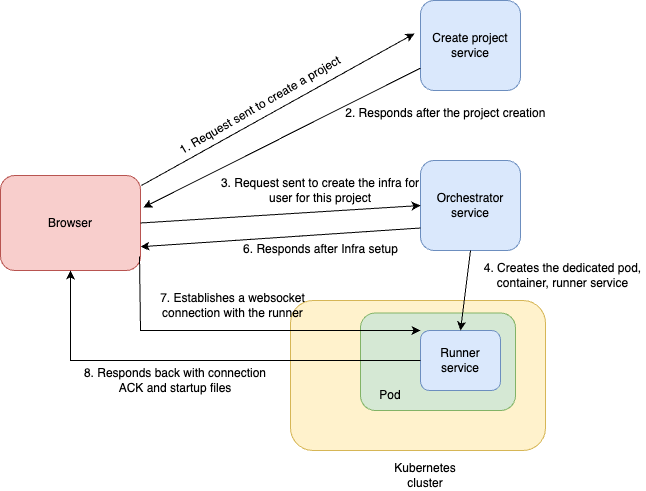
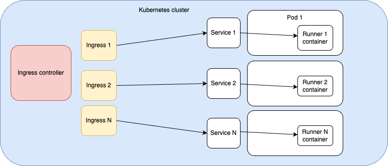
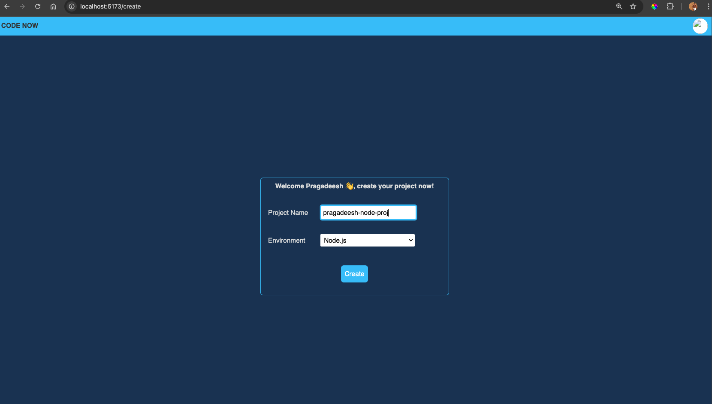
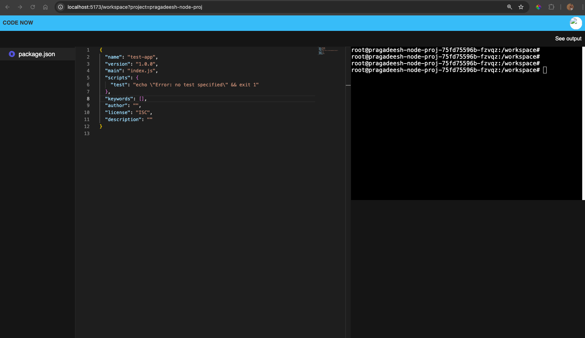
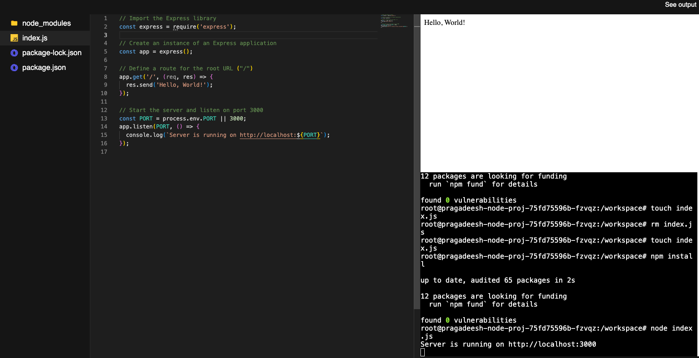

# Code Now - Online Development Environment

**Code Now** is a tool implemented to practice my Kubernetes concepts and deploy to a Kubernetes cluster.

## Overview

This tool provides a long-running code environment with isolated user workspaces to prevent resource contention and system downtime.

### Challenges Addressed

1. **Resource Contention**: Multiple users connecting to the same machine or set of machines could exhaust resources.
2. **System Stability**: Users could potentially disrupt the system by running commands that affect all users.

### Solutions Implemented

- **Isolated Environments**: Each user gets a dedicated environment.
- **Dynamic Resource Management**: Machines are provisioned and deprovisioned on the fly for each user.

## Architecture

### Magnified View of the Kubernetes Cluster

### Service Descriptions

1. **Create Project Service**

   - **Function**: Handles user requests to create new projects.
   - **Process**: Copies startup files from a template folder in S3 to a dedicated project folder in S3 for the user.

2. **Orchestration Service**

   - **Function**: Manages Kubernetes resources for user projects.
   - **Process**:
     - Dynamically creates Ingress, Service, and Pod resources for the project.
     - Parses templated Kubernetes configs to set up resources.
     - Pulls and starts the Runner Service image from Docker Hub.
   - **Note**: A single Ingress controller suffices, as it handles routing across multiple nodes.

3. **Runner Service**
   - **Function**: Maintains a WebSocket connection with the user's client.
   - **Process**:
     - Runs a WebSocket server to handle long-running connections.
     - Uses WebSocket for live file modifications.
     - Employs `node-pty` library for backend terminal sessions.
     - Integrates with `xterm.js` for terminal in the frontend.

Create Project Service, Orchestration Service and the Frontend Service is not part of the cluster. They can be run on local or any other instance.

Runner service is running inside its dedicated pod in the Kubernetes cluster

## Tools, Libraries, and Technologies Used

- **Node.js**
- **Kubernetes**
- **Docker**
- **Xterm.js**
- **Node-pty** (for backend terminal sessions)
- **TypeScript**
- **GCP** (Google Cloud Platform)
- **Socket.io**
- **Express**
- **Monaco Editor**
- **S3** (for file storage)

## Learnings from the Project

- Kubernetes setup on GCP: Ingress controllers, deployments, pods, Standard and Autopilot clusters.
- Dynamic resource creation in Kubernetes.
- Implementation of WebSockets for real-time communication.
- Use of `kubectl` commands and Kubernetes troubleshooting.
- Configuring routes, port mappings, and path rewriting in Ingress.

## TODOs

1. Leverage Kubernetes Secrets for storing credentials.
2. Extend support for multiple languages and frameworks beyond Node.js.
3. Restrict user access to dedicated containers.
4. Implement permanent file storage in S3.
5. Automatically deprovision pods after session termination.
6. Complete Login and Logout features.
7. Improve UI: Enhance look and feel, address loading state and scrolling issues.

## Potential Improvements

- **Use of Nix**: For better dependency management.
- **Dependency Caching**: To speed up build and deployment processes.
- **Volume Mounting**: For persistent storage needs.

## Screenshots of the running project

Video Recording - Demo
https://www.loom.com/share/adba01d3fe0144afb550e34657a24bab
